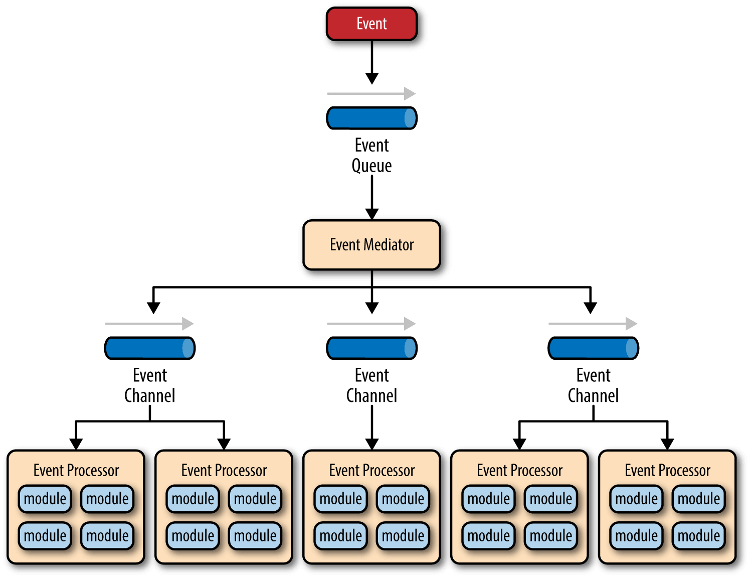

首先再次给出编程的定义：
> 把以自然语言描述的需求，转化为以形式语言描述的功能，最终用合适的方法编写为实现。

在不考虑无代码编程的情况下，编程可分为三部分：
- 用编程语言描述的实现；
- 用形式语言描述的功能;
- 用自然语言描述的需求。

接下来依次分析三个部分。

### 实现
即用合适的编程语言将各个功能阐明为代码（包括软件代码，硬件描述代码等）。这一层面显然具有四个要求：

#### 正确性
即编写的代码的运行结果符合预期，是对于程序员的最基本要求。根据计算机组成，正确性可以分为：
- 内部逻辑（所用规律、算法、数据结构等以及相互之间）正确性；
- 外部调用（调用API，引用第三方库等）约束满足性；
- 运行时环境（多线程/并发环境、硬件环境）正常性。

#### 可读性
即编写的代码便于人类（尤指非代码的编写者）阅读和理解，不包括由于细节实现引起的阅读困难（比如使用了实现复杂的数据结构），也即代码规范，包括：
- 命名规范，即标识符应具有意义。下方是四种常见的命名规范，大多情况下是这几种的结合：

| 匈牙利命名法（基本弃用） | 驼峰式命名法 | 帕斯卡命名法 | 下划线命名法 |
| :---: | :---: | :---: | :---: |
| `int iMyAge;` | `int myAge;` | `int MyAge;` | `int my_age;` |
| `char cMyName[10];` | `char myName[10];` | `char MyName[10];` | `char my_name[10];` |
| `float fManHeight;` | `float manHeight;` | `float ManHeight;` | `float man_height;` |

- 间距：`a = b + c;`和`a=b+c;`
- 换行：

<table>
    <tr>
        <th><code>int f() { }</code></th>
        <th><code>int f() { }</code></th>
    </tr>
</table>

- 缩进：使用`\t`还是空格，使用几个
- 注释：对于文件、功能、类、函数、语句等，在何种程度在何处以何种方式编写。
- 所用的编程语言、外部引用库等的特殊规范

#### 简洁性/灵活性
即编写的代码能以尽可能简洁灵活的实现功能，能够便于维护，也即代码的复用，包括：
- 组合式复用：通过将代码组织为若干尽可能不相交的部分并封装（即模块化），是的每个部分内部简单。
- 继承式复用：通过对代码抽象出 属于 这一关系，用父-子关系代表。
- 多态式复用：直接选取代码的公共部分保留。

#### 高效性
即编写的代码能（1）快速的、（2）少占用内存的情况下运行，可以分为：
- 对所用的所有算法、数据结构等的理论时间、空间复杂度；
- 代码实现层面上的运行效率和占用空间；
- 实际运行环境中特定操作的运行效率和占用空间；
- 多线程/并发环境中的运行效率和占用空间；

后三者统称为相对于理论时间、空间复杂度的相应常数。

---

### 功能
即以形式语言描述的内容。具体上，用形式语言描述，意味着在一定的框架内，预先定义若干具有一定含义的单词，内容通过这些单词的组合来明确描述。在这里强调的是，这些单词能够在实现层次上明确编写为代码。因此这个层面的要求就是——**在保证正确性的前提上，能够于可读性、简洁性/灵活性、高效性之间做平衡**。通常通过功能复杂程度、功能实现所需时间、软件实际运行环境进行平衡。

在实践中，这几者之间的平衡被被总结为以下三个方面：

#### 编程范式
如果将功能考虑为若干如同“谁（即对象）-做（即操作）-什么（即数据）”的事项的话，编程范式考虑的便是如何安排这些事项的顺序、如何组合这些事项。现有的编程范式有四种：
- 面向过程编程：将每个事项考虑为“做什么”的整体。直接将功能分为若干事项，令其依次排列而进行；
- 面向对象编程：将每个事项考虑为“谁-（与其他的谁）-做”。预先定义了若干对象“谁”，将功能分为对象和对象之间的操作，令操作依次进行；
- 函数式编程：将每个事项考虑为“做”。将功能分为若干纯函数（无副作用函数），令其嵌套执行；
- 面向数据编程：将每个事项考虑为“什么-做”。预先定义了数据，将功能转化为数据之上的像增删查改四类的简单操作并执行。

#### 代码架构
代码架构考虑的是若干功能之间的组织方式，尤其考察的是功能之间的耦合问题（即一个功能的实现依赖其他功能的具体实现）。现有的编程范式有五种：
- 单体架构：将所有的功能写在一起。保证了编程速度和开发速度，牺牲了其他一切。
- 分层架构：将所有功能组织为若干层，使得层之间的耦合尽可能的减少。便于各层各自维护和扩展。

 <i>三层架构</i>

 <i>四层架构</i>

- 事件驱动架构：每个功能组织为一个模块（事件处理器），模块间的交互抽象为事件/消息，事件在模块发生变化时会产生。同时维护一个处理事件的队列（事件队列），接受模块产生的事件、通过（分发器）分发并由交给相应模块处理。能够高度控制交互发生的时间、次数和频率。

 <i>事件驱动架构</i>

- 微服务架构：将每一个功能组织为相互独立、互相解构的部署单元。这些单元通过远程通信协议（比如REST、SOAP）联系。
- 微内核架构：取一个最小的核心功能作为内核，其余功能（主要功能、业务逻辑等）组织为互相独立的、可独立加载和卸载、避免出现互相依赖、尽可能避免相互通讯的插件。

#### 设计模式
设计模式是一些已有编程经验和惯例的总结，一般聚焦于某个功能的实现。接下来介绍一些常见的设计模式：
| 名称 | 定义 | 解释 | 特点 |
| :---: | :--- | :--- | :--- |
| 命令模式 | 将一个请求封装为一个对象，从而使你可用不同的请求对客户进行参数化； 对请求排队或记录请求日志，以及支持可撤销的操作。 | 将每一个功能都封装、抽象为一个对象，将功能的使用转化为对象的操作，同时可以定义操作的顺序、逆操作等。| 面向对象编程+回调函数。 |
| 享元模式 | 通过共享对象来减少系统种对象的数量。 | 将各类对象中的公共部分复用。通常复用对象实例化时就完成初始化的部分。 | 面向对象编程+复用 |
| 观察者模式 | 当一个对象（被观察者）的状态发生改变时，其所有依赖者（观察者）都会收到通知并自动更新。 | 被观察者的改变作为事件由所有观察者进行处理。 | 类似于事件驱动架构，大部分情况下都具有一个（全局的）消息队列（事件队列）处理事件。Unity的onXXX函数就是这种模式。 |
| 原型模式 | 用于创建重复的对象，同时又能保证性能。 | --- | Unity的预制件（Prefab） |
| 单例模式 | 保证一个类只有一个实例，并且提供了访问该实例的全局访问点。 | 在某种作用域内（通常为全局）内某些内容（数据、对象等）应该唯一存在，并且不使用全局变量（不容易控制行为），即进行封装。 | 当然想用全局变量也可以 |
| 状态机模式 | 对象的行为取决于其内部状态，并且在不同的状态下，对象可能会有不同的行为。 | 对象具有若干状态，状态在一定条件下改变。 | 将状态机（通常是有限状态自动机，FSM）这个概念使用在编程中。通常的动画机制用其实现。 |
| 桥接模式 | 把抽象化与实现化解耦。实体类的功能独立于接口实现类，这两种类型的类可被结构化改变而互不影响。 | 功能（考虑主体对客体操作）的主体、客体具有丰富的种类，而操作一致。为了方便主体、客体的修改、维护，利用组合将对应操作的代码复用。 | 面向对象编程+三层架构+组合复用。 |
| 工厂模式 | 考虑使得创建对象的过程与使用对象的过程分离的创建对象的方式。 | 想要创建的对象具有高度的相似性。工厂模式通过参数确定创建的对象（通常为对象类型的名称），并统一对象的使用方法。 | 面向对象编程+复用 |

### 需求
即软件所需要满足的所有功能之和。需求的描述是多样的，从需求到功能再到实现的路径也是多种多样的，但也可以做出一些划分：
- 需求的时效；
- 需求的来源：源自科学界（强调研究或验证）还是工业界（强调稳定、高效等）